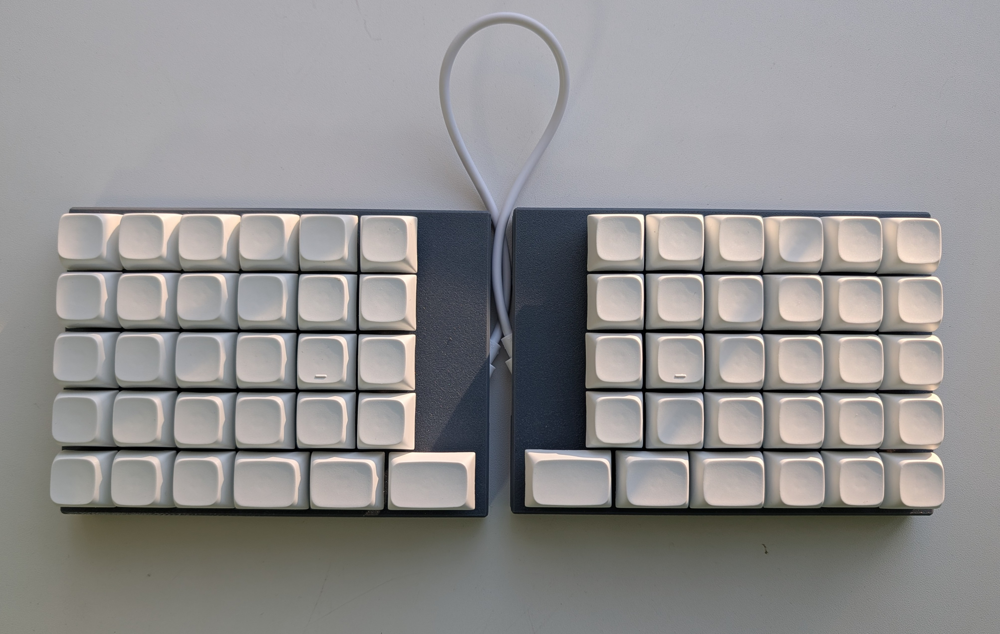

# Cornedeon Ortho 60 Keyboard
## Based on [Cornedeon Keyboard](https://github.com/alko-kbd/cornedeon)
5x6 ortho matrix with digital row.

Keyboard Maintainer: [alko](https://github.com/alko-kbd/cornedeon) [alko-kbd@alk0.ru](mailto:alko-kbd@alk0.ru)

Web Site: [cornedeon.ru](https://cornedeon.ru)

Hardware Supported: Handwired

### Build

Copy all files to directory: vial-qmk/keyboards/alko/cornedeon_ortho_60/

>qmk compile -kb alko/cornedeon_ortho_60 -km vial
